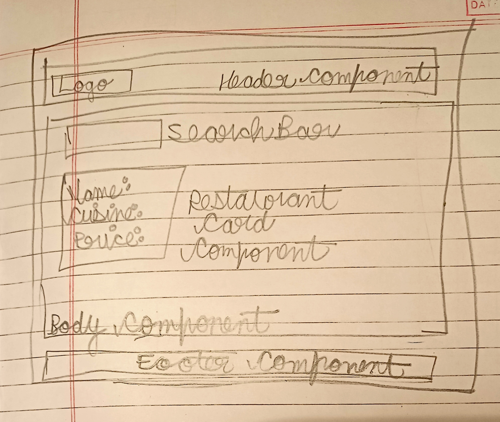

There are two syntaxes to create React element, one of them is to use the React.createElement API, the other one is to wrap the JSX code in curly braces. 

for example,consider the code: `const element = <h1>Hello, world!</h1>;`, the element variable now contains a React element. 

Some things to know, before we start coding.

Q1: Is using JSX compulsory in React?

A: No, we can use React elements. In fact, JSX behind the scenes, uses React elements.

`Q2: Is using ES6 compulsory for React?`

A2: The answer to this question, is also NO. React is a library, which doesn't force conditions on us in order to use it.

== Let's start with the coding part NOW!!! ==

Before writing code, it is always necessary to do planning, so that we are not confused on what to code.

Low level design of Food Villa App: 

Important point: Any piece of JSX can only have one parent tag, so either we can wrap the diblings in a single div or I can instead use React fragment.

Disadvantage of using div to wrap the siblings is that I have an extra div in the DOM tree, (go see it now!), which I don't want.

So, we can use React fragments instead of using a separate div.

